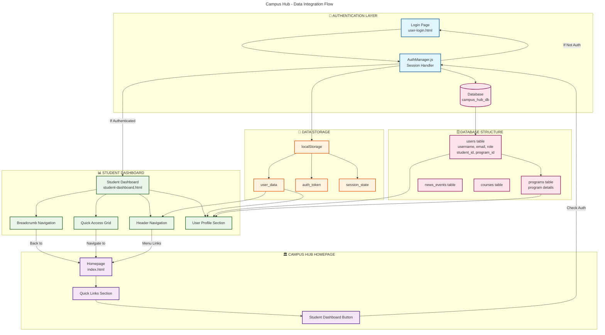

```mermaid
---
title: Campus Hub - Data Integration Flow
---
flowchart TD
    %% User Authentication
    subgraph "🔐 AUTHENTICATION LAYER"
        LOGIN[Login Page<br/>user-login.html]
        AUTH[AuthManager.js<br/>Session Handler]
        DB[(Database<br/>campus_hub_db)]
    end
    
    %% Campus Hub Components
    subgraph "🏛️ CAMPUS HUB HOMEPAGE"
        HOME[Homepage<br/>index.html]
        QUICKLINKS[Quick Links Section]
        DASHBOARD_BTN[Student Dashboard Button]
    end
    
    %% Student Dashboard
    subgraph "📊 STUDENT DASHBOARD"
        DASHBOARD[Student Dashboard<br/>student-dashboard.html]
        HEADER[Header Navigation]
        BREADCRUMB[Breadcrumb Navigation]
        QUICKACCESS[Quick Access Grid]
        PROFILE[User Profile Section]
    end
    
    %% Data Storage
    subgraph "💾 DATA STORAGE"
        LOCALSTORAGE[localStorage]
        USERDATA[user_data]
        TOKEN[auth_token]
        SESSION[session_state]
    end
    
    %% Database Tables
    subgraph "🗄️ DATABASE STRUCTURE"
        USERS[users table<br/>username, email, role<br/>student_id, program_id]
        PROGRAMS[programs table<br/>program details]
        NEWS[news_events table]
        COURSES[courses table]
    end
    
    %% Data Flow Connections
    LOGIN --> AUTH
    AUTH --> DB
    DB --> USERS
    USERS --> PROGRAMS
    
    %% Session Data Flow
    AUTH --> LOCALSTORAGE
    LOCALSTORAGE --> USERDATA
    LOCALSTORAGE --> TOKEN
    LOCALSTORAGE --> SESSION
    
    %% Navigation Flow
    HOME --> QUICKLINKS
    QUICKLINKS --> DASHBOARD_BTN
    DASHBOARD_BTN --> |Check Auth| AUTH
    AUTH --> |If Authenticated| DASHBOARD
    AUTH --> |If Not Auth| LOGIN
    
    %% Dashboard Components
    DASHBOARD --> HEADER
    DASHBOARD --> BREADCRUMB
    DASHBOARD --> QUICKACCESS
    DASHBOARD --> PROFILE
    
    %% Data Integration Points
    USERDATA --> PROFILE
    USERDATA --> HEADER
    USERS --> PROFILE
    PROGRAMS --> PROFILE
    
    %% Return Navigation
    BREADCRUMB --> |Back to| HOME
    QUICKACCESS --> |Navigate to| HOME
    HEADER --> |Menu Links| HOME
    
    %% Styling
    classDef authClass fill:#e1f5fe,stroke:#01579b,stroke-width:2px
    classDef hubClass fill:#f3e5f5,stroke:#4a148c,stroke-width:2px
    classDef dashClass fill:#e8f5e8,stroke:#1b5e20,stroke-width:2px
    classDef dataClass fill:#fff3e0,stroke:#e65100,stroke-width:2px
    classDef dbClass fill:#fce4ec,stroke:#880e4f,stroke-width:2px
    
    class LOGIN,AUTH authClass
    class HOME,QUICKLINKS,DASHBOARD_BTN hubClass
    class DASHBOARD,HEADER,BREADCRUMB,QUICKACCESS,PROFILE dashClass
    class LOCALSTORAGE,USERDATA,TOKEN,SESSION dataClass
    class DB,USERS,PROGRAMS,NEWS,COURSES dbClass
```
